# Crucible: Autonomous Event-Driven Agent Architecture 🧠

## 1. System Overview
Crucible has evolved from a linear pipeline into an **Autonomous Event-Driven Mesh**. Agents are no longer passively invoked by a manager; they are active participants that "listen" to a shared data stream and "react" based on their domain expertise.

This architecture enables:
- **Parallel Execution**: Agents can work simultaneously when dependencies are met.
- **Self-Correction**: Agents can challenge each other's findings (e.g., Medication vs. Diagnosis).
- **Autonomous Resolution**: The system detects and resolves conflicts without human intervention using a "Judge" administrator.

---

## 2. Core Components

### 2.1 The Nervous System: `EventBus`
A localized Pub/Sub engine that allows agents to communicate asynchronously.
- **Publish**: Agents emit events (e.g., `DIAGNOSIS_PROPOSED`).
- **Subscribe**: Agents listen for specific topics (e.g., `EventBus.subscribe("DIAGNOSIS_PROPOSED", medication_agent)`).
- **Wildcard**: The Supervisor listens to `*` to monitor the entire flow.

### 2.2 The Engine: `EventOrchestrator`
Refactored from a linear sequencer to a **Dynamic Event Loop**.
- **Role**: Dispatches events, manages session state, and enforces Supervisor rulings.
- **Loop Logic**:
  ```python
  while not goal_met:
      event = bus.get_next()
      supervisor_directive = supervisor.monitor(event)
      
      if supervisor_directive == "CONTINUE":
          bus.dispatch(event)
      elif supervisor_directive == "RESOLVED":
          force_winner(supervisor_directive.winner)
  ```

### 2.3 The Judge: `AdministratorAgent`
A meta-agent that monitors the **Conversation Graph** metadata (not clinical content).
- **Loop Detection**: Identifies infinite cycles (e.g., A -> B -> A -> B).
- **Authority Resolution**: Uses a **Rank-Based Hierarchy** to resolve deadlocks.
- **Directives**:
  - `CONTINUE`: Normal flow.
  - `PAUSE`: Human intervention needed (Safety/Critical).
  - `STOP`: Session complete.
  - `RESOLVED`: Automated conflict resolution.

---

## 3. Agent Hierarchy & Ranks 👑
To prevent "Mob Rule" or endless debate, every agent is assigned a strict Authority Rank.

| Rank | Domain | Agents | Authority Scope |
| :--- | :--- | :--- | :--- |
| **100** | **SUPREME++** | `SafetyTriageAgent` | 🛑 **GOD-TIER**: Always halts the pipeline. Cannot be overruled. Final boss. |
| **10** | **SUPREME** | `UserAssistAgent` | Can halt the entire system. Overrides all clinical logic. |
| **9** | **FACT** | `ClinicalEntityAgent` | Source of truth for *what the patient said*. Cannot be overruled on transcript facts. |
| **8** | **AUTHORITY**| `DiagnosisMappingAgent`, `RiskAssessmentAgent` | Defines the clinical reality (ICD-10, Risk Level). Overrides downstream logistics. |
| **6** | **LOGIC** | `ProcedureCodingAgent` | Maps CPT codes based on Diagnosis/Time. |
| **5** | **OPINION** | `MedicationManagement`, `TreatmentPlanning` | Expert opinions that *support* the diagnosis but must yield if contradicted. |
| **1** | **UTILITY** | `OutputGenerationAgent` | Formats data. No decision power. |

### Debate Ownership Rule
When the `SafetyTriageAgent` raises a question or concern, only the **triggering agent** (the agent whose event caused the safety check) is authorized to respond and continue the debate. This prevents cross-talk and ensures focused resolution.

---

## 4. "Debate Mode" & Feedback Loops ⚔️
The system supports specific cyclic dependencies to allow for self-correction.

### The Conflict Loop (Example)
1. **Diagnosis Agent** proposes: *Major Depressive Disorder (F32.9)*.
2. **Medication Agent** (listening) sees: *Lithium*.
3. **Medication Agent** detects conflict: *"Lithium suggests Bipolar, not MDD."*
4. **Medication Agent** emits: `MEDICATION_CHECKED` with a flag.
5. **Diagnosis Agent** (listening) wakes up: *"New evidence from Meds. Re-evaluating..."*
6. **Diagnosis Agent** updates: *Bipolar Disorder (F31.9)*.

### The Resolution (If they argue)
If they enter an infinite loop (MDD -> No It's Bipolar -> No It's MDD...), the Administrator intervenes:
1. **Detects**: Loop (Dx -> Meds -> Dx -> Meds).
2. **Compares**: Dx Rank (8) vs Meds Rank (5).
3. **Rules**: **Diagnosis Wins**.
4. **Action**: The medication input is noted as "Off-label" or "Incongruent" but the Diagnosis stands.

---

## 5. Visual Architecture

```mermaid
graph TB
    subgraph "Administrator Layer (The Judge)"
        Sup[👨‍⚖️ Administrator Agent]
    end

    subgraph "Event Mesh (The Agents)"
        UA[User Assist] -->|TRANSCRIPT_READY| EventBus
        EventBus -->|ORIENTATION| ST[Safety Triage]
        ST -->|SAFETY_CLEARED| CE[Clinical Entity]
        
        CE --> DM[Diagnosis Agent]
        CE --> MM[Medication Agent]
        
        %% The Debate Loop
        DM -.->|DIAGNOSIS_PROPOSED| MM
        MM -.->|MEDICATION_CHECKED| DM
        
        DM -->|FINAL_DIAGNOSIS| PC[Procedure Codes]
        MM --> TP[Treatment Plan]
        PC --> TP
        
        TP -->|PLAN_COMPLETE| OG[Output Gen]
    end

    EventBus <--> Sup
    EventBus ==>|Directives| Orchestrator
    
    style Sup fill:#f9f,stroke:#333
    style DM fill:#9f9,stroke:#333
    style MM fill:#9f9,stroke:#333
```



## 6. How to Extend
To add a new agent:
1. Create `NewAgent` class inheriting `BaseAgent`.
2. Define `listen_for = ["SOME_EVENT_TOPIC"]`.
3. Assign a **Rank** in `Orchestrator.__init__`.
4. Register in `Orchestrator.agents`.

---

## 7. Blackboard Logging 📜
Complete audit trail for detailed post-session analysis. All data is persisted to the filesystem.

### Log Structure
```
backend/logs/sessions/{session_id}/
├── blackboard.jsonl          # Append-only event log (JSONL)
├── context_snapshots/        # Full context dumps at key moments
│   ├── 123456_after_safety_triage.json
│   └── ...
└── agent_outputs/            # Raw agent I/O per execution
    ├── diagnosis_mapping_123456.json
    └── ...
```

### Logged Events
| Level | Event Types | Description |
|-------|-------------|-------------|
| `EVENT` | `TRANSCRIPT_READY`, `SAFETY_CLEARED`, etc. | Every bus event |
| `AGENT_START` / `AGENT_COMPLETE` | Agent lifecycle | Includes duration_ms |
| `CONTEXT_UPDATE` | `CONTEXT_SNAPSHOT` | Full blackboard state |
| `CLARIFICATION` | Request/Response | Human-in-the-loop interactions |
| `ADMINISTRATOR` | `STOP`, `PAUSE`, `RESOLVED` | Judge decisions |
| `SYSTEM` | `WORKFLOW_START`, `WORKFLOW_COMPLETE` | Session lifecycle |

### Usage
```python
from app.core.blackboard_logger import blackboard_logger

# Read session log for analysis
entries = blackboard_logger.get_session_log("session-uuid")
```
